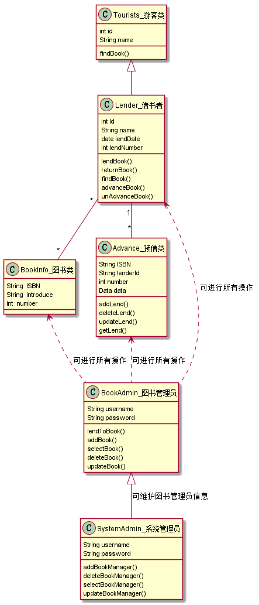
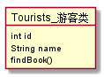
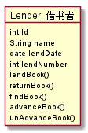
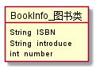
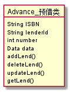
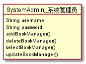

# 实验3：图书管理系统领域对象建模
|学号|班级|姓名|
|:-------:|:-------------:|:----------:|
|201510414113|软件(本)15-1|江自杰|

## 1. 图书管理系统的类图

### 1.1 类图PlantUML源码如下：

```
@startuml

Tourists_游客类 : int id
Tourists_游客类 : String name
Tourists_游客类 : findBook()

Lender_借书者 : int Id
Lender_借书者 : String name
Lender_借书者 : date lendDate
Lender_借书者 : int lendNumber
Lender_借书者 : lendBook()
Lender_借书者 : returnBook()
Lender_借书者 : findBook()
Lender_借书者 : advanceBook()
Lender_借书者 : unAdvanceBook()

BookInfo_图书类 : String  ISBN
BookInfo_图书类 : String  introduce
BookInfo_图书类 : int  number

Advance_预借类 : String ISBN
Advance_预借类 : String lenderId
Advance_预借类 : int number
Advance_预借类 : Data data
Advance_预借类 : addLend()
Advance_预借类 : deleteLend()
Advance_预借类 : updateLend()
Advance_预借类 : getLend()

BookAdmin_图书管理员 : String username
BookAdmin_图书管理员 : String password
BookAdmin_图书管理员 : lendToBook()
BookAdmin_图书管理员 : addBook()
BookAdmin_图书管理员 : selectBook()
BookAdmin_图书管理员 : deleteBook()
BookAdmin_图书管理员 : updateBook()

SystemAdmin_系统管理员 : String username
SystemAdmin_系统管理员 : String password
SystemAdmin_系统管理员 : addBookManager()
SystemAdmin_系统管理员 : deleteBookManager()
SystemAdmin_系统管理员 : selectBookManager()
SystemAdmin_系统管理员 : updateBookManager()

Tourists_游客类 <|-- Lender_借书者
Lender_借书者"*" -- "*"BookInfo_图书类
Lender_借书者"1" -- "*"Advance_预借类
BookInfo_图书类 <.. BookAdmin_图书管理员:可进行所有操作
Advance_预借类 <.. BookAdmin_图书管理员:可进行所有操作
Lender_借书者 <.. BookAdmin_图书管理员:可进行所有操作
BookAdmin_图书管理员 <|-- SystemAdmin_系统管理员:可维护图书管理员信息
@enduml
```

### 1.2. 类图如下：



### 1.3. 类图说明：
```
Advance_预借类是由Lender_借书者类产生的，当借书者成功借书后便会调用此类
Lender_借书者是Tourists_游客类的子类，拥有借书的权限
BookAdmin_图书管理员类可对图书及借书者进行管理
SystemAdmin_系统管理员是权限最高的，拥有一切权力，并可对图书管理者进行管理
```


## 2. 图书管理系统的对象图
### 2.1 Tourists_游客类
#### 源码如下：
``` 
@startuml
object Tourists_游客类{
    int id
    String name
    findBook()
}
@enduml
```
#### 对象图如下：


### 2.2 Lender_借书者
#### 源码如下：
```
@startuml
object Lender_借书者{
    int Id
    String name
    date lendDate
    int lendNumber
    lendBook()
    returnBook()
    findBook()
    advanceBook()
    unAdvanceBook()
}
@enduml
```
#### 对象图如下：


### 2.3 BookInfo_图书类
#### 源码如下：
``` 
@startuml
object BookInfo_图书类{
    String  ISBN
    String  introduce
    int  number
}
@enduml
```
#### 对象图如下：


### 2.4 Advance_预借类
#### 源码如下：
```
@startuml
object Advance_预借类{
    String ISBN
    String lenderId
    int number
    Data data
    addLend()
    deleteLend()
    updateLend()
    getLend()
}
@enduml
```
#### 对象图如下：


### 2.5 BookAdmin_图书管理员
#### 源码如下：
```
@startuml
object BookAdmin_图书管理员{
    String username
    String password
    lendToBook()
    addBook()
    selectBook()
    deleteBook()
    updateBook()
}
@enduml
```
#### 对象图如下：


### 2.6 SystemAdmin_系统管理员
#### 源码如下：
```
@startuml
object SystemAdmin_系统管理员{
    String username
    String password
    addBookManager()
    deleteBookManager()
    selectBookManager()
    updateBookManager()
}
@enduml
```
#### 对象图如下：

