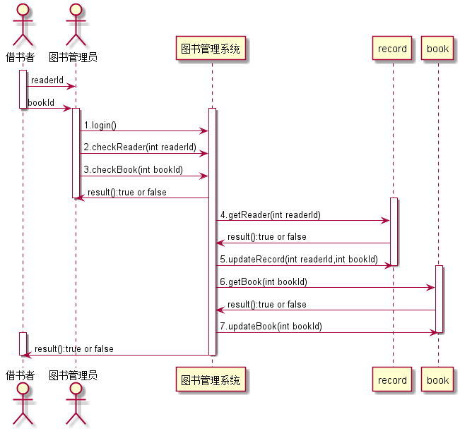
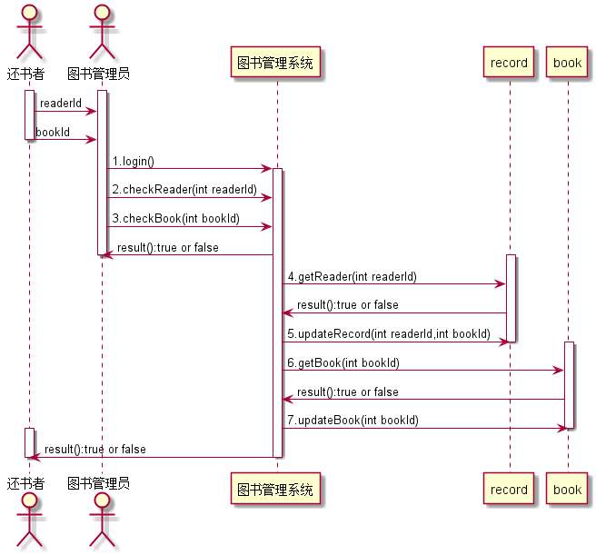

# 实验4：图书管理系统顺序图绘制
|学号|班级|姓名|
|:-------:|:-------------: | :----------:|
|201510414113|软件(本)15-1|江自杰|

## 图书管理系统的顺序图

## 1. 借书用例
## 1.1. 借书用例PlantUML源码

``` sequence
@startuml
actor  借书者 as lender
actor  图书管理员 as bookAdmin
activate lender
activate bookAdmin
lender->bookAdmin:提供自身id
lender->bookAdmin:提供借书id
deactivate lender
bookAdmin->图书管理系统:login()
activate 图书管理系统
bookAdmin->图书管理系统:1.checkLend(int lendId):查询借书者身份
bookAdmin->图书管理系统:2.checkBook(int bookId):查询所借书籍是否可借
bookAdmin<-图书管理系统:result():true or false
deactivate bookAdmin
activate lend
图书管理系统->lend:3.getLender(int lendId)
图书管理系统<-lend:result():true or false
activate book
图书管理系统->book:4.getBook(int bookId)
图书管理系统<-book:result():true or false
图书管理系统->book:5.reduceBook(int bookId)
deactivate book
图书管理系统->lend:5.updateLend(int lendId,int bookId)
deactivate lend
图书管理系统->lender:result
activate lender
deactivate lender
deactivate 图书管理系统
@enduml
```
## 1.2. 借书用例顺序图


## 1.3. 借书用例顺序图说明
```
1. login()：图书管理员登录
2. checkLend(int lendId)：查询读者的身份是否存在
3. checkBook(int bookId)：查询该书籍是否存在
4. result()：返回查询的结果：true or false;
5. getLender(int lendId)：获取读者身份
6. getBook(int bookId)：获取图书
7. reduceBook(int bookId)：减少该图书的数量
8. updateLend(int bookId,int lendId)：修改读者的借书记录
  ```
  
## 2. 还书用例
## 2.1. 还书用例PlantUML源码

``` sequence
@startuml
actor  还书者 as returnBook
actor  图书管理员 as bookAdmin
activate returnBook
activate bookAdmin
returnBook->bookAdmin:提供自身id
returnBook->bookAdmin:提供借书id
deactivate returnBook
bookAdmin->图书管理系统:login()
activate 图书管理系统
bookAdmin->图书管理系统:1.checkLend(int returnId):查询还书者身份
bookAdmin->图书管理系统:2.checkBook(int bookId):查询所还书籍是否属于该图书馆
bookAdmin<-图书管理系统:result():true or false
deactivate bookAdmin
activate lend
图书管理系统->lend:3.getReturner(int returnId)
图书管理系统<-lend:result():true or false
图书管理系统->lend:4.updateLend(int returnId,int bookId)
deactivate lend
activate book
图书管理系统->book:5.getBook(int bookId)
图书管理系统<-book:result():true or false
图书管理系统->book:6.addBook(int bookId)
deactivate book
activate returnBook
图书管理系统->returnBook:result():true or false
deactivate returnBook
deactivate 图书管理系统
@enduml
```

## 2.2. 还书用例顺序图


## 2.3. 还书用例顺序图说明
```
1. login()：图书管理员登录
2. checkLend(int lendId)：查询读者的身份是否存在
3. checkBook(int bookId)：查询该书籍是否存在
4. result()：返回查询的结果：true or false;
5. getReturner(int returnId)：获取读者身份
6. getBook(int bookId)：获取图书
7. addBook(int bookId)：增加该图书的数量
8. updateLend(int bookId,int lendId)：修改读者的借书记录
```
