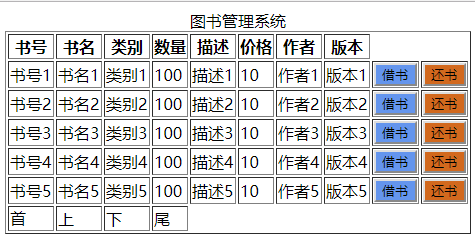

# 实验5：图书管理系统数据库设计与界面设计
|学号|班级|姓名|
|:-------:|:-------------: | :----------:|
|201510414113|软件(本)15-1|江自杰|

## 1.数据库表设计

## 1.1. 图书信息表
|字段|类型|主键，外键|可以为空|默认值|约束|说明|
|:-------:|:-------------:|:------:|:----:|:---:|:----:|:-----|
|ISBN|varchar(50)|主键|否||||
|bookName|varchar(50)| |否||||
|bookType|varchar(50)| |否||||
|describe|varchar(200)| |否||||
|price|double| |否||||
|author|varchar(50)| |否||||
|bookVersion|varchar(50)| |否||||
|bookNum|int| |否||||

## 1.2. 图书记录表
|字段|类型|主键，外键|可以为空|默认值|约束|说明|
|:-------:|:-------------:|:------:|:----:|:---:|:----:|:-----|
|recordId|int|主键|否||||
|ISBN|varchar(50)| |否||||
|bookName|varchar(50)| |否||||
|bookNum|varchar(50)| |否||||
|readerId|int| |否||||

## 1.3. 读者信息表
|字段|类型|主键，外键|可以为空|默认值|约束|说明|
|:-------:|:-------------:|:------:|:----:|:---:|:----:|:-----|
|readerId|int|主键|否||||
|readerName|varchar(50)| |否||||
|password|varchar(50)| |否||||
|role|bit| |否||||

## 1.4. 图书管理员信息表
|字段|类型|主键，外键|可以为空|默认值|约束|说明|
|:-------:|:-------------:|:------:|:----:|:---:|:----:|:-----|
|bookManagerId|int|主键|否||||
|bookManagerName|varchar(50)| |否||||
|password|varchar(50)| |否||||
|role|bit| |否||||

***

## 2. 界面设计
## 2.1. 借书界面设计

- 用例图参见：借书用例
- 类图参见：借书类，读者类
- 顺序图参见：借书顺序图
- API接口如下：

1. 借阅者API

- 功能：获取用户基本信息
- 请求地址： http://localhost:8080/BM/api/readerList
- 请求方法：GET
- 请求参数：

|参数名称|必填|说明|
|:-------:|:-------------: | :----------:|
|readerId|是|读者的id|
|access_tip|是|用于验证请求合法性的认证信息。 |
|method|是|固定为 “GET”。|

- 返回示例：
```
{
  "data": [
        {
            "id": "1001",
            "name": "张三"
        }
    ],
    "code": 200
}
```
- 返回参数说明：
    
|参数名称|说明|
|:-------:|:-------------: |
|data|用户的信息|
|code|返回码|

2. 验证API
- 功能：用于读者id是否存在
- 请求地址： http://localhost:8080/BM/api/checkReader
- 请求方法：GET
- 请求参数：

|参数名称|必填|说明|
|:-------:|:-------------: | :----------:|
|readerId|是|读者的id|
|action|是|固定为 “checkReaderId”。|
|access_tip|是|用于验证请求合法性的认证信息。 |
|method|是|固定为 “GET”。|

- 返回实例：
```
{
    "info":"验证成功",
      "code":200
}
```
- 返回参数说明：
    
|参数名称|说明|
|:-------:|:-------------: |
|Info|返回验证信息|
|code|返回码|


 

