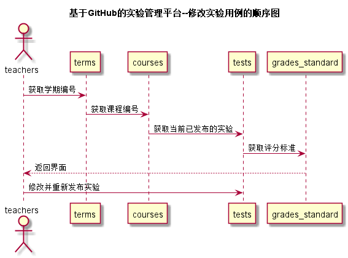

<!-- markdownlint-disable MD033-->
<!-- 禁止MD033类型的警告 https://www.npmjs.com/package/markdownlint -->

# “修改实验”用例 [返回](../README.md)
## 1. 用例规约

|用例名称|修改实验|
|-------|:-------------|
|功能|以表格形式显示需修改的实验，允许用户删除|
|参与者|老师|
|前置条件|老师需要先登录|
|后置条件| |
|主事件流| 1.进入修改实验界面 2.选择学期与课程 3.修改已发布的实验，可删除|
|备选事件流| 1a.内容输入有错 1.系统提示用户重新输入|

## 2. 业务流程（顺序图） [源码](../src/修改实验.puml)
 

## 3. 界面设计
- 界面参照: https://jiangzijie123.github.io/is_analysis/test6/ui3/修改实验.html
- API接口调用
    - 接口1：[getTests](../impl/getTests.md) 
    - 接口2：[getGrandsStandard](../impl/getGrandsStandard.md) 
    - 接口3：[setTests](../impl/setTests.md) 
    - 接口4：[setGrandsStandard](../impl/setGrandsStandard.md) 

## 4. 算法描述
无
    
## 5. 参照表

- [COURSES](../数据库设计.md/#COURSES)
- [TERMS](../数据库设计.md/#TERMS)
- [TESTS](../数据库设计.md/#TESTS)
- [GRADES_STANDARD](../数据库设计.md/#GRADES_STANDARD)

