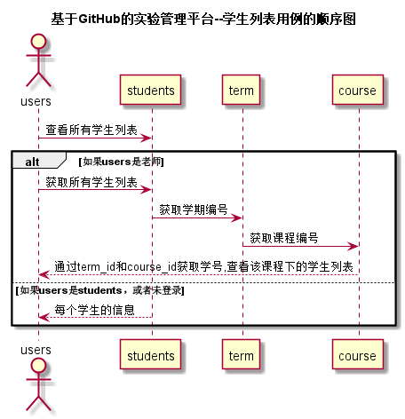

<!-- markdownlint-disable MD033-->
<!-- 禁止MD033类型的警告 https://www.npmjs.com/package/markdownlint -->

# “学生列表”用例 [返回](../README.md)
## 1. 用例规约

|用例名称|学生列表|
|-------|:-------------|
|功能|以表形式的显示出所有学生的信息|
|参与者|游客，学生，老师|
|前置条件|学生，老师需要先登录|
|后置条件| |
|主事件流| |
|备选事件流| |

## 2. 业务流程（顺序图） [源码](../src/sequence学生列表.puml)
 

## 3. 界面设计
- 界面参照: https://zwdbox.github.io/is_analysis/test6/ui/index.html
- API接口调用
    - 接口1：[getStudents](../接口/getStudents.md) 

## 4. 算法描述

- WEB_SUM解析为列表  
  - WEB_SUM是接口getStudents的返回值中的一部分，形如："WEB_SUM": "1.2.3，2.3.4,N"。需要在前端进行解析。  
  - 作用是判断GitHub网址是否正确，用逗号分开，1.2.3代表实验地址正确，N代表不正确。  
  - 第1位代表学期的编号，第2位表示课程的编号，第3位表示实验编号。
  - 比如：“1.2.3”表示编号为1的学期的编号为2的课程的编号为3的实验地址正确。  
  - 算法是使用使用字符串分离方法将其分开。

- RESULT_COURSE解析为列表
    - RESULT_COURSE是接口getStudents的返回值中的一部分，形如："RESULT_COURSE": "1.2，2.3"或"N"。需要在前端进行解析。
    - 选课列表（来自COURSE表），以逗号分开，第一个数是学期编号,第二个数是课程编号，N表示没有选课。    
    - 比如：“1.2，2.3”表示所选的课程为编号为1的学期的编号为2的课程。
    - 算法是使用使用字符串分离方法将其分开。
    
## 5. 参照表

- [STUDENTS](../数据库文件.md/#STUDENTS)
- [COURSE](../数据库文件.md/#COURSE)
- [TERM](../数据库文件.md/#TERM)
- [GRADE](../数据库文件.md/#GRADE)
- [TESTS](../数据库文件.md/#TESTS)

