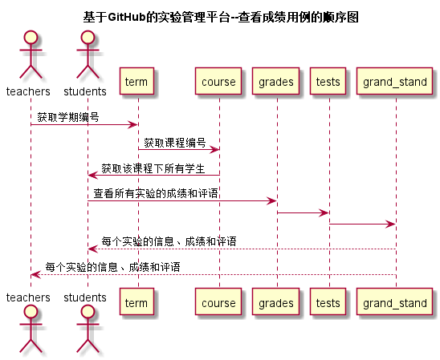

<!-- markdownlint-disable MD033-->
<!-- 禁止MD033类型的警告 https://www.npmjs.com/package/markdownlint -->

# “查看成绩”用例 [返回](../README.md)
## 1. 用例规约

|用例名称|查看成绩|
|-------|:-------------|
|功能|学生或老师查看每个实验的实验成绩及实验评价|
|参与者|学生，老师|
|前置条件|学生或老师需要先登录|
|后置条件| |
|主事件流| |
|备选事件流| |

## 2. 业务流程（顺序图） [源码](../src/查看成绩.puml)
 

## 3. 界面设计
- 界面参照: https://zwdbox.github.io/is_analysis/test6/ui/查看成绩.html
- API接口调用
    - 接口1：[getOneStudentResults](../接口/getOneStudentResults.md) 

## 4. 算法描述
 - 学生查看成绩：
    - 首先获取学生id，从前端传入的学生选择的学期id，课程id
    - 先通过学生id从GRADE表中获取关于该学生的所有实验
    - 再结合学期id和课程id从TESTS表中获取关于该学生指定学期指定课程的所有实验
 - 老师查看成绩：
    - 首先通过前端传入的学期id,与课程id；
    - 从STUDENTS表中获取对应的学生列表
    - 再由点击指定的学生获取学生学号通过上述方法查看该学生的实验成绩。
    
## 5. 参照表
- [STUDENTS](../数据库文件.md/#STUDENTS)
- [TEACHERS](../数据库文件.md/#TEACHERS)
- [GRADE](../数据库文件.md/#GRADE)
- [TESTS](../数据库文件.md/#TESTS)
- [COURSE](../数据库文件.md/#COURSE)
- [TERM](../数据库文件.md/#TERM)
- [GRADE_STAND](../数据库文件.md/#GRADE_STAND)
