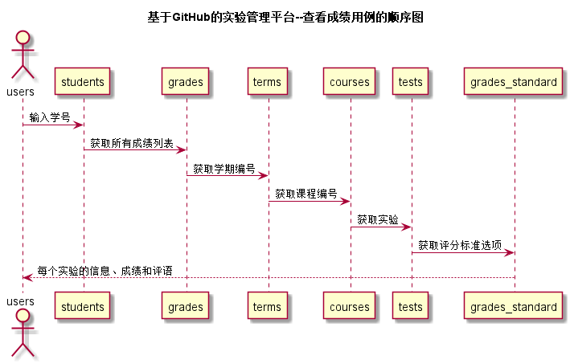

<!-- markdownlint-disable MD033-->
<!-- 禁止MD033类型的警告 https://www.npmjs.com/package/markdownlint -->

# “查看成绩”用例 [返回](../README.md)
## 1. 用例规约

|用例名称|查看成绩|
|-------|:-------------|
|功能|学生或老师查看每个实验的实验成绩及实验评价|
|参与者|学生，老师|
|前置条件|学生或老师需要先登录|
|后置条件| |
|主事件流| |
|备选事件流| |

## 2. 业务流程（顺序图） [源码](../src/查看成绩.puml)
 

## 3. 界面设计
- 界面参照: https://jiangzijie123.github.io/is_analysis/test6/ui2/查看成绩.html
- API接口调用
    - 接口1：[getTests](../impl/getTests.md) 
    - 接口2：[getGrades](../impl/getGrades.md) 
    - 接口3：[getGradesStandard](../impl/getGradesStandard.md) 

## 4. 算法描述
 无
    
## 5. 参照表
- [STUDENTS](../数据库设计.md/#STUDENTS)
- [GRADES](../数据库设计.md/#GRADES)
- [TESTS](../数据库设计.md/#TESTS)
- [COURSES](../数据库设计.md/#COURSES)
- [TERMS](../数据库设计.md/#TERMS)
- [GRADES_STANDARD](../数据库设计.md/#GRADES_STANDARD)
