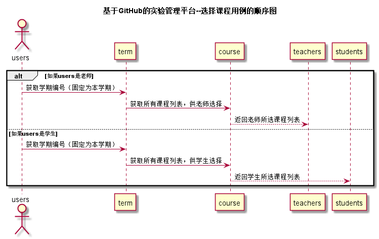

<!-- markdownlint-disable MD033-->
<!-- 禁止MD033类型的警告 https://www.npmjs.com/package/markdownlint -->

# “选择课程”用例 [返回](../README.md)
## 1. 用例规约

|用例名称|选择课程|
|-------|:-------------|
|功能|提供老师或学生选择相应的课程|
|参与者|学生，老师|
|前置条件|学生，老师需要先登录，学生选课应在老师之后|
|后置条件| |
|主事件流| 1.老师查看当前学期课程列表选择 2.在老师选课结束后，由学生进行选课|
|备选事件流| 1a.老师所选课程超过指定人数则不能进行选择 2a.学生选课人数超过指定人数则不能进行选择|

## 2. 业务流程（顺序图） [源码](../src/选择课程.puml)
 

## 3. 界面设计
- 界面参照: https://zwdbox.github.io/is_analysis/test6/ui/index.html
- API接口调用
    - 接口1：[getStudents](../接口/getStudents.md) 

## 4. 算法描述
- 老师选择课程
    - 判断老师是否在选课期间
    - 获取可选的课程列表
    - 返回所选课程列表
- 学生选择课程
    - 判断老师选课是否结束
    - 判断学生是否在选课期间
    - 获取可选的课程列表
    - 返回所选课程列表
    
## 5. 参照表
- [STUDENTS](../数据库设计.md/#STUDENTS)
- [TEACHERS](../数据库设计.md/#TEACHERS)
- [COURSES](../数据库设计.md/#COURSES)
- [TERMS](../数据库设计.md/#TERMS)
